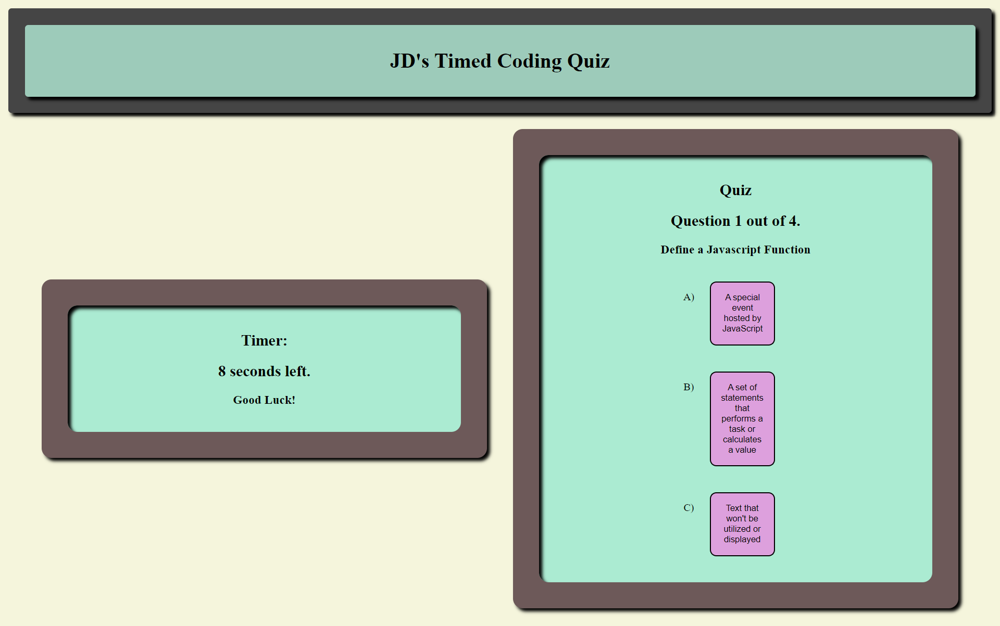

# timedQuiz_uncbc_JDM

## Description

Provide a short description explaining the what, why, and how of your project. Use the following questions as a guide:

- What was your motivation? I wanted to build a timed quiz that would check the answers submitted and provide the user a score
- Why did you build this project? I wanted to experiement with query selectors and try some stuff with local storage.
- What problem does it solve? It's the beginning of a way for me to build test or quizzes for students.
- What did you learn? I learned how to use JavaScript objects as a container for thematic data that I can pull from later

## Installation

Navigate to the website.

## Usage

    

## Credits
UNC Coding Bootcampt

## License

MIT
--
